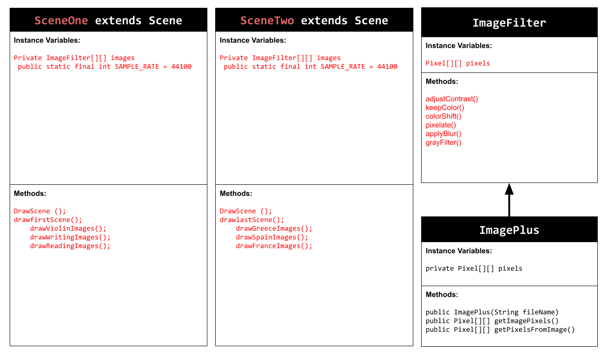
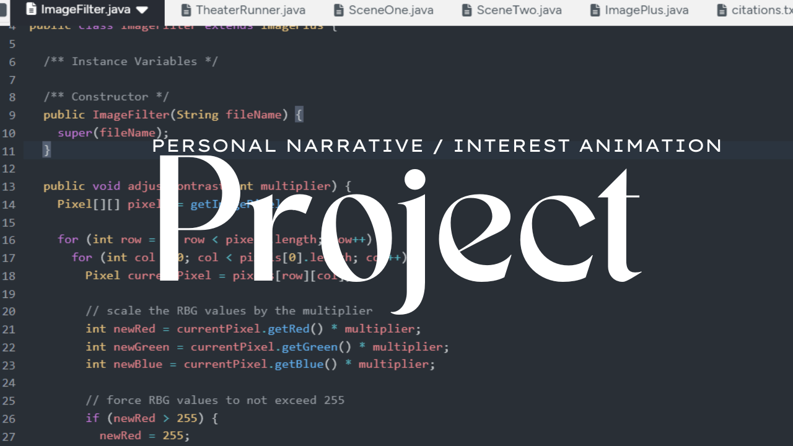

# Unit 5 - Personal Narrative / Interest Animation

## Introduction

Images are often used to portray our personal experiences and interests. We also use image filters and effects to change or enhance the mood of an image. When combined into collages and presentations, these images tell a story about who we are and what is important to us. Your goal is to create an animation using The Theater and Scene API that consists of images of your personal experiences and/or interests. In this animation, you will incorporate data related to these experiences and/or interests that can be organized in a 2D array, and use image filters and effects to change or enhance the mood of your images.
## Requirements

Use your knowledge of object-oriented programming, two-dimensional (2D) arrays, and algorithms to create your personal narrative collage or animation:
- **Write Scene subclasses** – Create two Scene subclasses: either two core parts of your personal life, or two components of a personal interest. Each class must contain a constructor and private instance variable with data related to the scene
- **Create at least two 2D arrays** – Create at least two 2D arrays to store the data that will make up your visualization.
Implement algorithms – Implement one or more algorithms that use loops and logic that operate on the data in your 2D arrays.
- **Create a visualization** – Create an animation that conveys the story of the data by illustrating the patterns or relationships in the data.
- **Image Filters** – Utilize the image filters created in this unit (and possible new filters) that show a personal flare to the images used in your animation.
- **Document your code** – Use comments to explain the purpose of the methods and code segments and note any preconditions and postconditions.

## UML Diagram

## Video

## Story Description

My story is about my hobbies along with something I would like to do in the future. My hobbies showcased in this include Violin, Writing, and Reading which include the last two books that I read. My travel goals include my most want to visit places which are Greece, Spain, and France. All these are presented throughout my project by using 2d arrays to store the data which are images and display them methodically according to the story. The type of data in the 2d arrays are the images.

## Image Filter Analysis

For my adjustContrast filter it works by changing the multiplier of the pixels to a higher or lower degree in order to enhance or change the contrast of the image. The addBlur filter works by changing the size of the pixels to make the image more blurry and unnoticable by changing the pixels in the image.